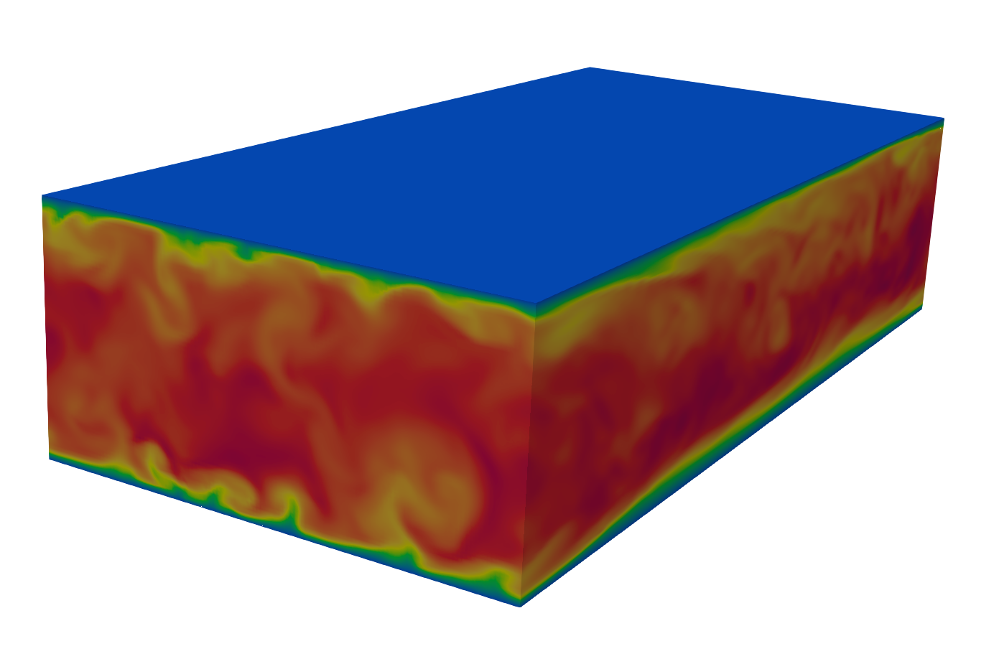

# TCF36

Extended version of MHIT36 for turbulent channel flow.
Finite-difference code based on the fractional step method.
Solution of Navier-Stokes equations + phase-field method (ACDI) + energy equation (passive scalar).

Time integration, two options:
- Fully explicit: Euler explicit for ACDI + RK3 for Navier-Stokes and temperature
- Implicit CN for z-diffusive terms of Navier-Stokes equations and RK3 for the rest of the NS terms, RK3 for temperature and Euler explicit for ACDI. This latter option is not fully implemented, only the skeleton and the TDMA are present.


If you use this code, please cite the following work: 
```bibtex
  @article{roccon2025,
  title   = {MHIT36: A Phase-Field Code for Gpu Simulations of Multiphase Homogeneous Isotropic Turbulence},
  author  = {Roccon, A. and Enzenberger, L. and Zaza, D. and Soldati, A.},
  journal = {Computer Physics Communications (in press)},
  year    = {2025},
  doi     = {https://doi.org/10.1016/j.cpc.2025.109804}
}
```


## Check list of TCF36
- Boundary condition for no-slip at the two walls ✅
- Laminar solution (no need of TDMA) ✅
- TDMA ✅
- TDMA validation ✅ 
- Turbulent channel flow ✅ 
- Stretched grids 🚧
- Implicit diffusion along z (skeleton and flag introduced) 🚧

## How to run TCF36
**Compile cuDecomp**  
- Build the library using the provided `*_lib.sh` script.  
- Output locations:  
  - **Library:** `cuDecomp/build/lib`  
  - **Headers:** `cuDecomp/build/include`  
- ⚠️ Compile using **NVIDIA HPC-SDK**.  

**Compile & run Multi-GPU version**  
- Source code in **`multi/`**.  
- Use `local.sh`, `leo.sh`, or `mn5.sh` depending on your system.  
- Relies on cuDecomp for pencil decomposition, transpositions, and halo exchanges.  

**Autotuning of decomposition**  
- Default: `pr=0` and `pc=0` → enables **automatic process decomposition**.  
- Only input needed: **total number of MPI tasks**.  
- ✅ No recompilation required when changing MPI processes.  

**Optional features (conditional compilation)**  
- **Phase-field module:** Can be enabled or disabled. Default is single-phase.  
- **Implicit diffusion along z:** Can be enabled or disabled. ⚠️ Not yet implemented.  


## Turbulent channel flow 



## Performance and resolution tested (NS only)

- 256 x 128 x 200 - 31 ms/iter - 2 x RTX5000 16GB 
- 2048 x 768 x 576 - 323 ms/iter - 4 x A100 64 GB 

## Contributing

We welcome all contributions that can enhance TCF36, including bug fixes, performance improvements, and new features. 
If you would like to contribute, please contact me or open an Issue in the repository.