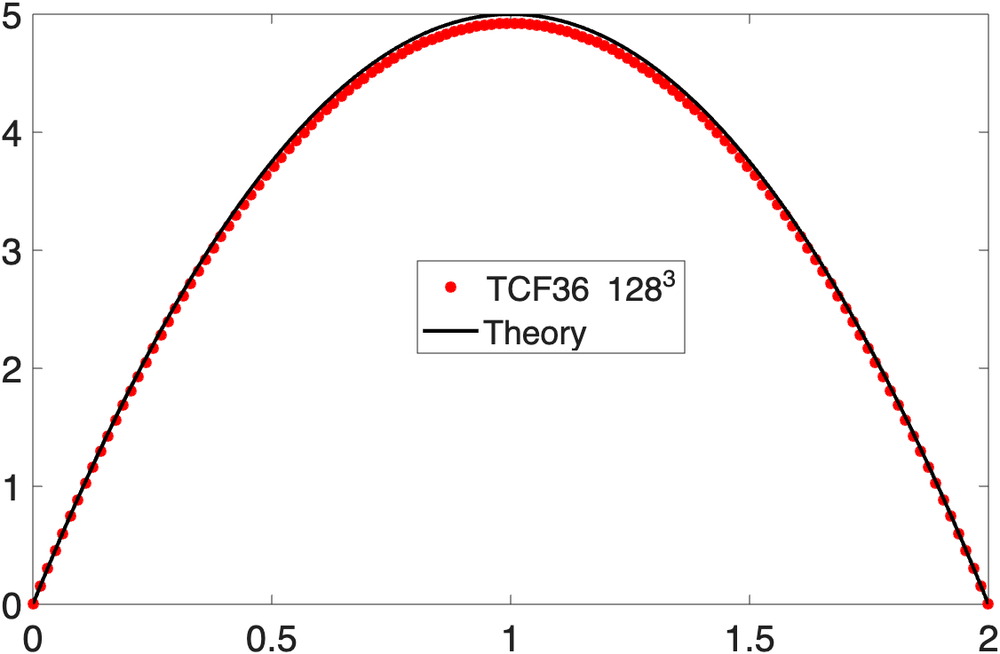

# TCF36

Extended version of MHIT36 for channel flow.

If you use this code, please cite the following work: 
```bibtex
  @article{roccon2025,
  title   = {MHIT36: A Phase-Field Code for Gpu Simulations of Multiphase Homogeneous Isotropic Turbulence},
  author  = {Roccon, A. and Enzenberger, L. and Zaza, D. and Soldati, A.},
  journal = {SSRN},
  year    = {2025},
  doi     = {http://dx.doi.org/10.2139/ssrn.5264052}
}
```


## Check list of features implemented in TCF36
- Boundary condtion for no-slip at the two wall 🚧
- Laminar solution (no need of TDMA) 🚧
- TDMA 🚧
- Turbuletn channel flow 🚧
- Stretched grids 🚧

## Run the code

- Compile first the cuDecomp library using *_lib.sh, the resulting modules and library will be located in cuDecomp/build/lib and cuDecomp/build/include
- Double check cuDecomp building is fine (must be compiled using HPC-SDK)
- Folder multi: contains the source-code of the multi GPU version of the code. Use local.sh, leo.sh or mn5.sh to compile and run the code; the multi GPU version relies on cuDecomp for pencils transpositions and halo exchanges.
- Autotuning of the multi-GPU version: Default pr=0 and pc=0 enables autotuging (when cuDecomp is initialized), cuDecomp will perform an autotuning at the start finding the best decomposition (the only input is the total number of tasks). In this way, everyhting is automatic and the code does not need to be recompiled when changing the number of MPI processes.
- A conditional compilation flag is used to enable or not the phase-field module. By default is single-phase only.


## Validation

Benchamrk present in "W.M.VanRees, A.Leonard, D.Pullin, P.Koumoutsakos, A comparison of vortex and pseudo-spectral methods for the simulation of periodic vortical flows at high Reynolds numbers,J. Comput. Phys.2 30(8)(2011)2794–2805" and also Used in CaNS.

Time evolution of the viscous dissipation:




## Contributing

We welcome all contributions that can enhance MHIT36, including bug fixes, performance improvements, and new features. 
If you would like to contribute, please contact aroccon or open an Issue in the repository.