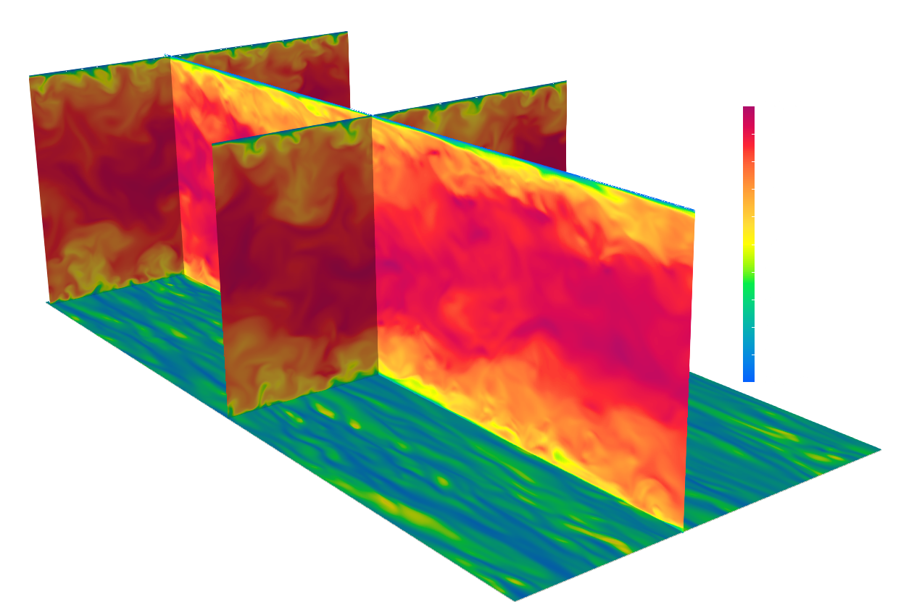

# TCF36

Code for turbulent channel flow simulations.
Finite-difference code based on the fractional step method.
Solution of Navier-Stokes equations + phase-field method (ACDI) + energy equation (passive scalar).
For time integration, a fully explicit scheme is used: Euler explicit for ACDI + RK3 for Navier-Stokes and temperature

If you use this code, please cite the following work: 
```bibtex
  @article{roccon2025,
  title   = {MHIT36: A Phase-Field Code for Gpu Simulations of Multiphase Homogeneous Isotropic Turbulence},
  author  = {Roccon, A. and Enzenberger, L. and Zaza, D. and Soldati, A.},
  journal = {Computer Physics Communications (in press)},
  year    = {2025},
  doi     = {https://doi.org/10.1016/j.cpc.2025.109804}
}
```

## Check list of features implemented in TCF36
- Boundary condition for no-slip at the two walls ✅
- Laminar solution (uniform and non-uniform grids) ✅
- TDMA validation ✅ 
- Turbulent channel flow ✅ 
- Stretched grids ✅

## How to run TCF36
**Compile cuDecomp**  
- Build the library using the provided `*_lib.sh` script.  
- Output locations:  
  - **Library:** `cuDecomp/build/lib`  
  - **Headers:** `cuDecomp/build/include`  
- ⚠️ Compile using **NVIDIA HPC-SDK**.  

**Compile & run Multi-GPU version**  
- Source code in **`multi/`**.  
- Use `local.sh`, `leo.sh`, or `mn5.sh` depending on your system.  
- Relies on cuDecomp for pencil decomposition, transpositions, and halo exchanges.  

**Autotuning of decomposition**  
- Default: `pr=0` and `pc=0` → enables **automatic process decomposition**.  
- Only input needed: **total number of MPI tasks**.  
- ✅ No recompilation required when changing MPI processes.  

**Optional features (conditional compilation)**  
- Phase-field module: Can be enabled or disabled. Default is single-phase.  
- Passive scaler: Can be enabled or disabled. Default is single-phase.  

## Turbulent channel flow 
- TCF at Rey_tau=590, Grid: 1536 x 768 x 576



## Performance and resolution tested (NS only)

- 256 x 128 x 200 - 31 ms/iter - 2 x RTX5000 16GB 
- 512 x 256 x 384 - 15 ms/iter - 4 x A100 64 GB 
- 1536 x 768 x 576 - 220 ms/iter - 4 x A100 64 GB 
- 2048 x 768 x 576 - 323 ms/iter - 4 x A100 64 GB 
- 2048 x 768 x 576 - 127 ms/iter - 16 x A100 64 GB 
- 3456 x 1296 x 960 - 720 ms/iter - 16 x A100 64 GB

## Nodes numbering and staggered grid

X-pencil configuration:


## Contributing

We welcome all contributions that can enhance TCF36, including bug fixes, performance improvements, and new features. 
If you would like to contribute, please contact me or open an Issue in the repository.